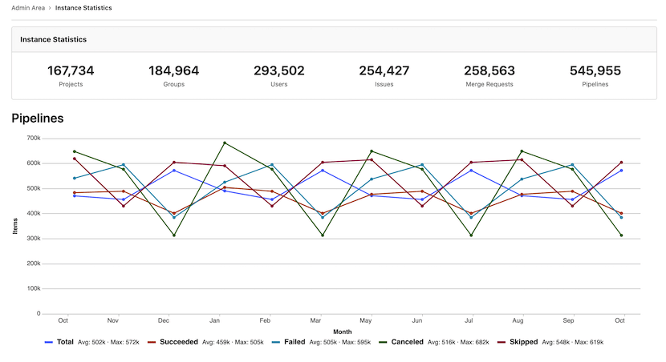

# Usage Trends **(FREE SELF)**

> - [Introduced](https://gitlab.com/gitlab-org/gitlab/-/issues/235754) in GitLab 13.5 behind a feature flag, disabled by default.
> - [Became enabled by default](https://gitlab.com/gitlab-org/gitlab/-/merge_requests/46962) in GitLab 13.6.
> - [Renamed](https://gitlab.com/gitlab-org/gitlab/-/issues/285220) from Instance Statistics to Usage Trends in GitLab 13.6.
> - It's enabled on GitLab.com.
> - It's recommended for production use.

Usage Trends gives you an overview of how much data your instance contains, and how quickly this volume is changing over time.
Usage Trends data refreshes daily.

## View Usage Trends

To view Usage Trends:

1. On the left sidebar, select **Search or go to**.
1. Select **Admin Area**.
1. Select **Analytics > Usage Trends**.

## Total counts

At the top of the page, Usage Trends shows total counts for:

- Users
- Projects
- Groups
- Issues
- Merge requests
- Pipelines

These figures can be useful for understanding how much data your instance contains in total.

## Past year trend charts

Usage Trends also displays line charts that show total counts per month, over the past 12 months,
in the categories shown in [Total counts](#total-counts).

These charts help you visualize how rapidly these records are being created on your instance.

