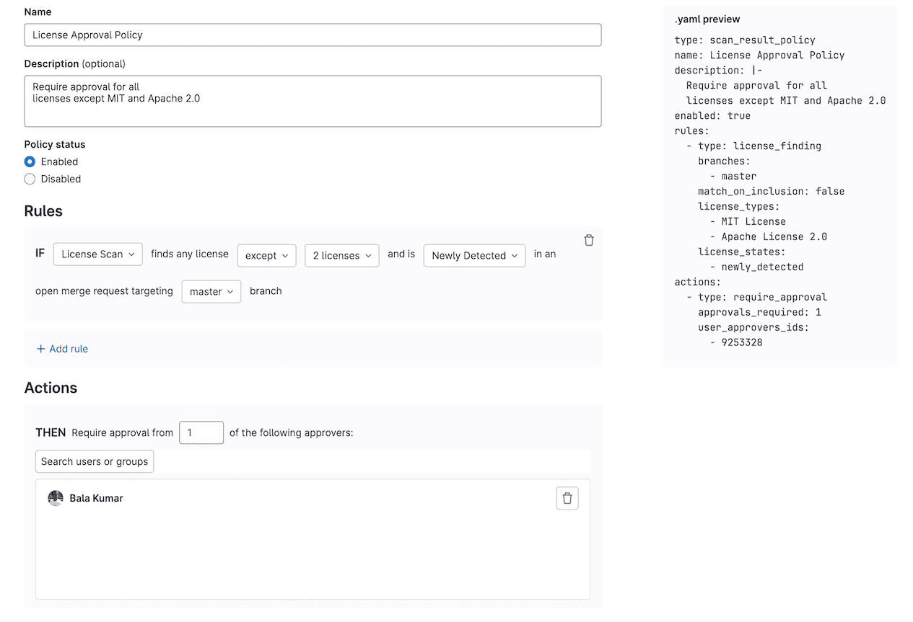

# License Approval Policies **(ULTIMATE)**

> [Introduced](https://gitlab.com/groups/gitlab-org/-/epics/8092) in GitLab 15.9 [with a flag](../../administration/feature_flags.md) named `license_scanning_policies`. Disabled by default.

License Approval Policies allow you to specify multiple types of criteria that define when approval is required before a merge request can be merged in. The following video provides an overview of these policies.

  See the video: <a href="https://www.youtube.com/watch?v=34qBQ9t8qO8">Overview of GitLab License Approval Policies</a>.

<figure class="video-container">
  <iframe src="https://www.youtube-nocookie.com/embed/34qBQ9t8qO8" frameborder="0" allowfullscreen> </iframe>
</figure>

## Create a new license approval policy

Create a license approval policy to enforce license compliance.

To create a license approval policy:

1. [Link a security policy project](../application_security/policies/index.md#managing-the-linked-security-policy-project) to your development group, subgroup, or project (the Owner role is required).
1. On the top bar, select **Main menu > Projects** and find your project.
1. On the left sidebar, select **Security & Compliance > Policies**.
1. Create a new [Scan Result Policy](../application_security/policies/scan-result-policies.md).
1. In your policy rule, select **License scanning**.

## Criteria defining which licenses require approval

The following types of criteria can be used to determine which licenses are "approved" or "denied" and require approval.

- When any license in a list of explicitly prohibited licenses is detected.
- When any license is detected except for licenses that have been explicitly listed as acceptable.

## Criteria comparing licenses detected in the merge request branch to licenses detected in the default branch

The following types of criteria can be used to determine whether or not approval is required based on the licenses that exist in the default branch:

- Denied licenses can be configured to only require approval if the denied license is part of a dependency that does not already exist in the default branch.
- Denied licenses can be configured to require approval if the denied license exists in any component that already exists in the default branch.

If a license is found that violates the license approval policy, it blocks the merge request and instructs the developer to remove it. Note, the merge request is not able to be merged until the `denied` license is removed unless an eligible approver for the License Approval Policy approves the merge request.

## Troubleshooting

### The License Compliance widget is stuck in a loading state

A loading spinner is displayed in the following scenarios:

- While the pipeline is in progress.
- If the pipeline is complete, but still parsing the results in the background.
- If the license scanning job is complete, but the pipeline is still running.

The License Compliance widget polls every few seconds for updated results. When the pipeline is complete, the first poll after pipeline completion triggers the parsing of the results. This can take a few seconds depending on the size of the generated report.

The final state is when a successful pipeline run has been completed, parsed, and the licenses displayed in the widget.
